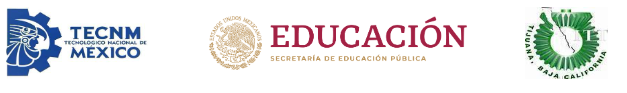

# Examen Recuperacion Primer Opertunidad Unidad 2

## Índice
- [Codigo](Codigo/readme.md)
- [Resumen](Resumen/readme.md)

------

<pre>

	

Tecnológico Nacional de México
Instituto Tecnológico de Tijuana

Departamento de Sistemas y Computación
Ingeniería en Sistemas Computacionales

Semestre:
Agosto - Diciembre 2023

Materia:
Lenguajes de interfaz

Docente:
M.C. Rene Solis Reyes 

Unidad:
2

Título del trabajo:
GUIA DE EXAMEN Y EXAMEN

Estudiante:
Valdez Medina Victorio Giovanni

	

</pre>

